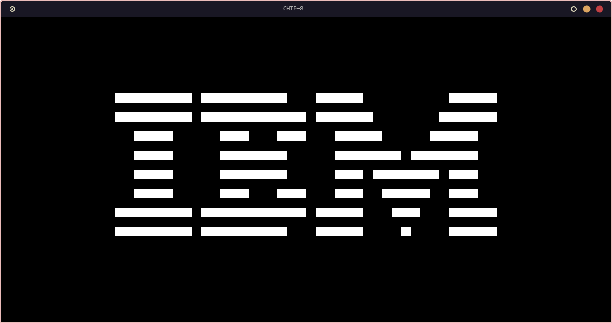

# CHIP-8 Emulator
- The classic CHIP-8 emulator, made to learn how emulators and CPUs work.
- Written in C and SDL for graphics (made in Linux).
- Can load programs in memory from ROM files. 


### Still work in progress (can only run the IBM logo)

# Installation and running

- You need `gcc`, `make` and `SDL2`.
- Simply clone the repo, compile it and run the emulator using a ROM file from the ./ROM folder.

```
git clone https://github.com/SHOREQU69/CHIP-8-Emulator
cd CHIP-8-Emulator
make
./chip8 ./ROM/IBM_Logo.ch8
```
